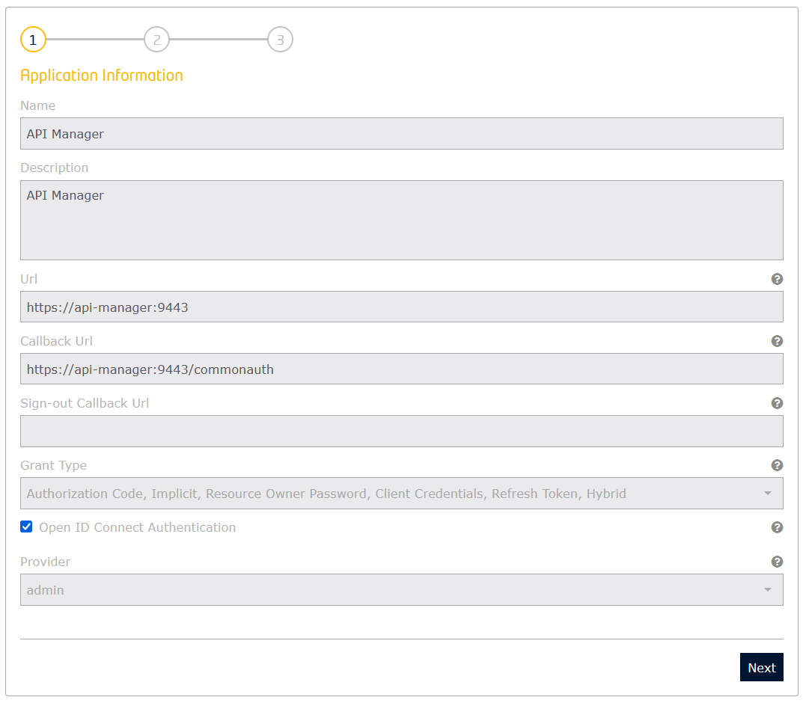
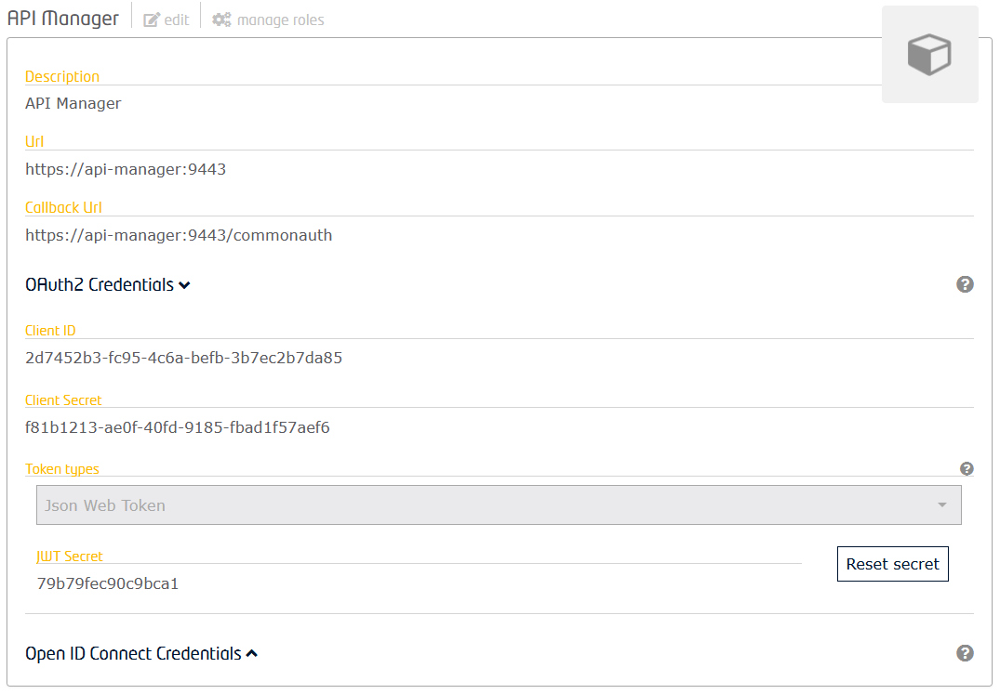
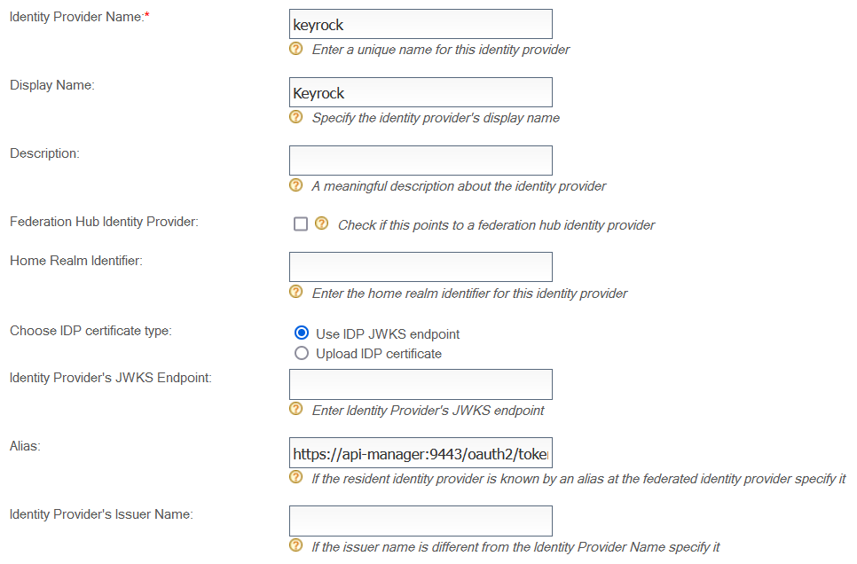
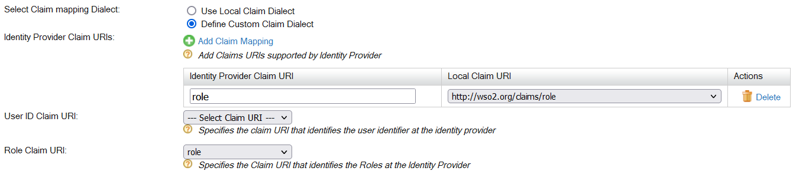
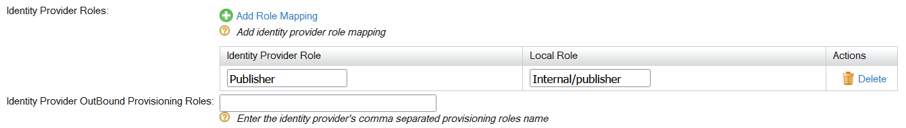
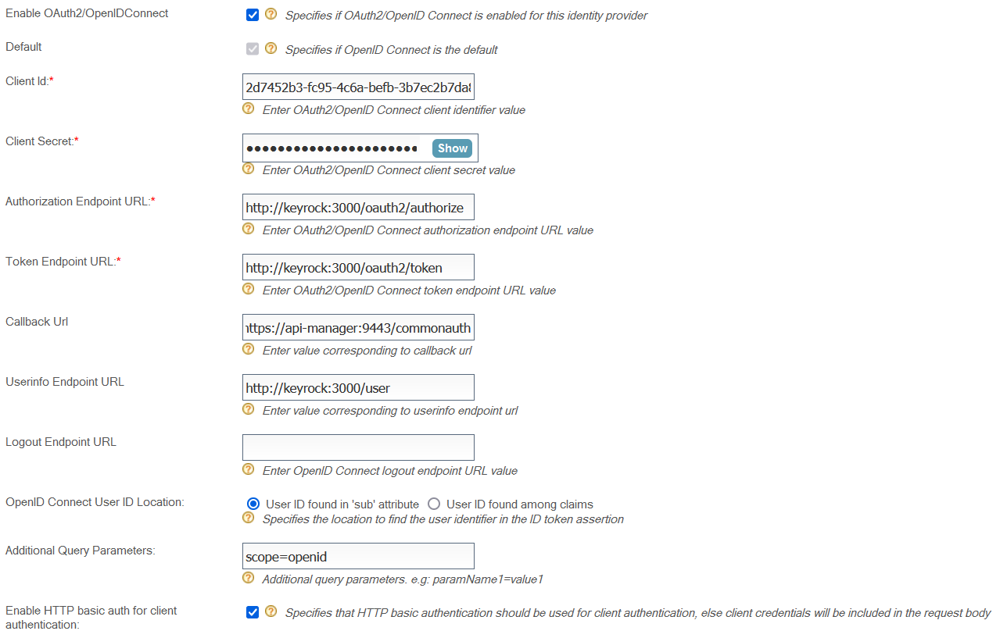
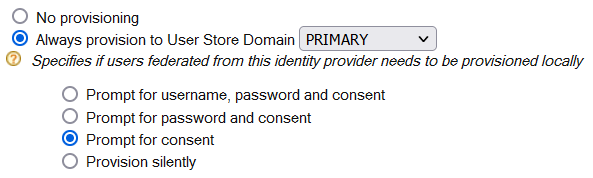
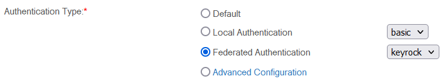

# WSO2 API Manager configuration for Keyrock

## Keyrock configuration

Go to Keyrock and sign in as admin

Create a new application (Home > Applications > Register)



Enable **Json Web Token** (OAuth2 Credentials > Token types)



## API Manager configuration

Go to the management console

### Identity provider

Create a new identity provider (Identity Providers > Add)

**Basic Information**



**Claim Configuration > Basic Claim Configuration**



**Role Configuration**



**Federated Authenticators > OAuth2/OpenID Connect Configuration**



**Just-in-Time Provisioning**



### Service provider

List identity providers (Identity Providers > List)

Edit **apim_publisher**

> You must have accessed the publisher at least once for it to appear in this list.

**Local & Outbound Authentication Configuration**



### Roles

Create roles (Users and Roles > Add > Add New Role)

### Configuration file

wso2am-4.1.0/repository/conf/deployment.toml

```
[user_store]
…
username_java_script_regex = '(.*?)'
username_java_regex = '(.*?)'
```
